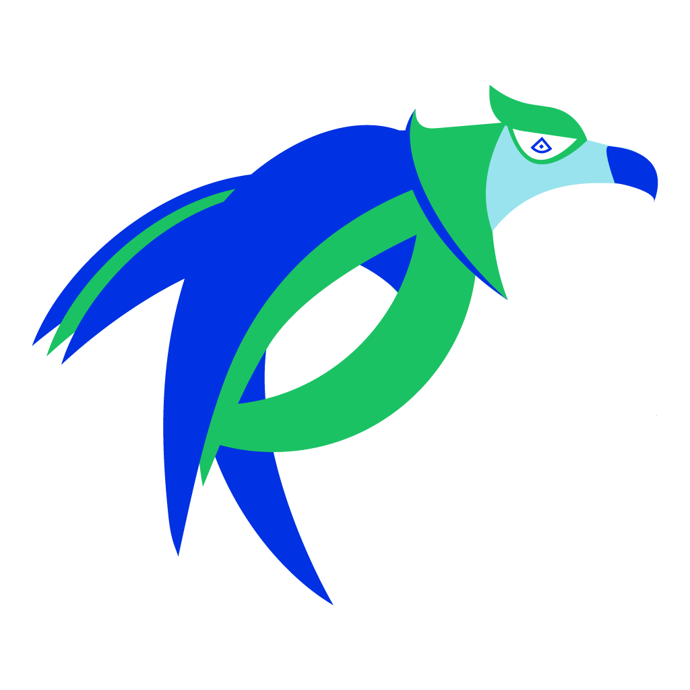

[](https://opensource.org/licenses/Apache-2.0)




## Kubernetes Native Image Scanning

Harness your existing Container Image Vulnerability Scanning information to your Kubernetes Cluster.
**iskan** enables you:
- [x] Plug one or more image registries such as ECR, GCR and others
- [x] Analyse the running Pods and their containers for known vulnerabilities
- [x] Control the scan scope to certain namespace
- [x] Filter scan results by: Severity, CVSS Score, Fixable CVEs, and even snooze specific CVEs.

**iskan** simplifies querying and creation RBAC policies.

Supported Vulnerability Scan Providers
- [x] AWS ECR
- [x] GCP GCR
- [ ] Azure ACR
- [ ] WhiteSource
- [ ] VMWare Harbor
- [ ] Docker Trusted Registry
- [ ] Quay
- [ ] JFrog X-Ray


## Install

Download the latest from the [release](https://github.com/alcideio/iskan/releases) page

```shell script
curl https://raw.githubusercontent.com/alcideio/iskan/master/download.sh | bash
```
# Usage

- [The `iskan cluster` command](#scan-cluster)
- [The `iskan image` command](#scan-image)
- [Command Line Reference](#command-line-reference)
- [Contributing](#contributing)

## Scan Cluster

```shell script
Get vulnerabilities information on the presently running containers

Usage:
  iskan cluster [flags]

Aliases:
  cluster, scan-cluster

Flags:
  -c, --api-config string          The Vulnerability API configuration file name
      --cluster-context string     Cluster Context .use 'kubectl config get-contexts' to list available contexts
      --filter-cvss float32        Include CVEs with CVSS score greater or equal than the specified number. Valid values: 0.0-10.0
      --filter-fixable-only        Include CVEs with which are fixable
      --filter-severity string     Select which severities to include. Comma seperated MINIMAL,LOW,MEDIUM,HIGH,CRITICAL
  -f, --format string              Output format. Supported formats: json | yaml | table (default "json")
  -h, --help                       help for cluster
      --namespace-exclude string   Namespaces to exclude from the scan (default "kube-system")
      --namespace-include string   Namespaces to include in the scan (default "*")
  -o, --outfile string             Output file name. Use '-' to output to stdout (default "iskan")
  -r, --report-config string       The Report configuration file name

Global Flags:
  -v, --v Level   number for the log level verbosity
```

## Scan Image


```shell script
Get vulnerabilities information for a given container image

Usage:
  iskan image [flags]

Aliases:
  image, scan-image, i, container, scan-container

Examples:
iskan image --image="gcr.io/myproj/path/to/myimage:v1.0" --api-config myconfig.yaml -f table --filter-severity CRITICAL,HIGH

Flags:
  -c, --api-config string        The Vulnerability API configuration file name
      --filter-cvss float32      Include CVEs with CVSS score greater or equal than the specified number. Valid values: 0.0-10.0
      --filter-fixable-only      Include CVEs with which are fixable
      --filter-severity string   Select which severities to include. Comma seperated MINIMAL,LOW,MEDIUM,HIGH,CRITICAL
  -f, --format string            Output format. Supported formats: json | yaml | table (default "json")
  -h, --help                     help for image
  -i, --image string             container image for which vulnerabilities information should be obtained

Global Flags:
  -v, --v Level   number for the log level verbosity
```

## Command Line Reference

```bash
iskan

Usage:
  iskan [command]

Available Commands:
  bash-completion Generate bash completion. source < (advisor bash-completion)
  cluster         Get vulnerabilities information on the presently running containers
  help            Help about any command
  image           Get vulnerabilities information for a given container image
  version         Print iskan version

Flags:
  -h, --help      help for iskan
  -v, --v Level   number for the log level verbosity

```

## Contributing

### Bugs

If you think you have found a bug please follow the instructions below.

- Please spend a small amount of time giving due diligence to the issue tracker. Your issue might be a duplicate.
- Open a [new issue](https://github.com/alcideio/iskan/issues/new/choose) if a duplicate doesn't already exist.

### Features

If you have an idea to enhance iskan follow the steps below.

- Open a [new issue](https://github.com/alcideio/iskan/issues/new/choose).
- Remember users might be searching for your issue in the future, so please give it a meaningful title to helps others.
- Clearly define the use case, using concrete examples.
- Feel free to include any technical design for your feature.

### Pull Requests

- Your PR is more likely to be accepted if it focuses on just one change.
- Please include a comment with the results before and after your change. 
- Your PR is more likely to be accepted if it includes tests. 
- You're welcome to submit a draft PR if you would like early feedback on an idea or an approach.


[](https://starchart.cc/alcideio/iskan)
